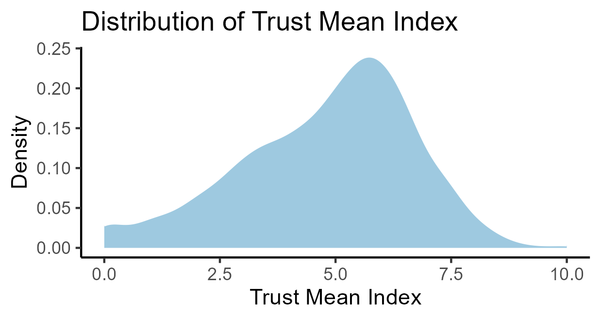
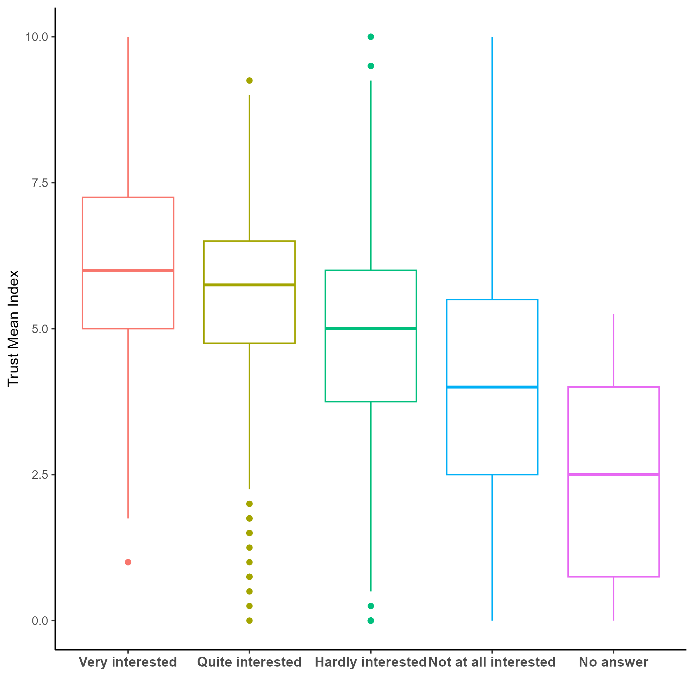

# **INTEREST IN POLITICS AND TRUST IN INSTITUTIONS**

Hypothesis: People ,in Italy, who are more interested in politics trust institutions more.

## ***Analysis***

The relationship between political interest and institutional trust is visually explored in the two graphs provided: a boxplot comparing levels of political interest with the Trust Mean Index, and a density plot showing the overall distribution of this index.

**1.Trust mean index**

As a proxy of institutional trust, a mean index was formed from the responses to four question: trust in the legal system, trust in political parties, trust in the police, trust in Parliament. In figure 1 is reported the distribution of said index.

{width="479"}

The index is slightly skewed to the left( μ = 4.81; σ = 1.89 / median = 5) . The majority of observations falls around the value "5" , indicating a moderate general trust in institutions.

***2. Interest in politics and trust***

{width="475"}

From Figure 2 a general trend emerges: as interest in politics increases, so does the median level of institutional trust. The group labeled "Very interested" has the highest median Trust Mean Index, around 6.5, with a relatively tight IQR indicating consistency within this group. The “Quite interested” group also shows relatively high trust, though with more variability and several low outliers, suggesting that not all politically interested individuals uniformly trust institutions.

Trust decreases slightly for the “Hardly interested” group, with the median dropping to about 5.0. Those who are “Not at all interested” display similar or slightly lower median trust scores and show the widest spread, indicating that this group is more heterogeneous in their trust levels. Lastly, the “No answer” group shows the lowest median trust and a narrower range, perhaps indicating disengagement or apathy reflected in both political interest and trust levels.

**3. Linear regression**

The result of the linear regression (Model 1), help us to quantify the co-variation visualized in point 2.

Taken the reference category "Very interested" with a mean trust index of 5.85, we can clearly see a negative pattern emerging, as we distance from the reference category. A part from "Quite interest" (whose coefficient is not statistically significant, mean the absence of difference from "Very interested"), all of the other groups report lower scores of trust, up to -3.38 for the "No answer". \
The results thus confirm our hypothesis of higher level of trust in the institutions, the higher the level of interest in politics.

```         
===========================Model 1== 
Intercept (Very interested)     5.85 ***
                               (0.19)    
Quite interested               -0.28                                    
                               (0.20)    
Hardly interested              -0.99 ***                                
                               (0.20)    
Not at all interested          -1.85 ***                                
                               (0.20)    
No answer                      -3.38 ***                                
                               (0.70)    
---------------------------------------- 
R^2                             0.11     
Adj. R^2                        0.11     
Num. obs.                    2865        
======================================== 
*** p < 0.001; ** p < 0.01; * p < 0.05
```

### Conclusions

Conclusion Together, these graphs support the hypothesis that political interest is positively associated with trust in institutions. Individuals who are more engaged in politics tend to report higher levels of institutional trust. However, the presence of variability within each group suggests that political interest is not the sole determinant of trust — other personal, social, or contextual factors likely play a role.
